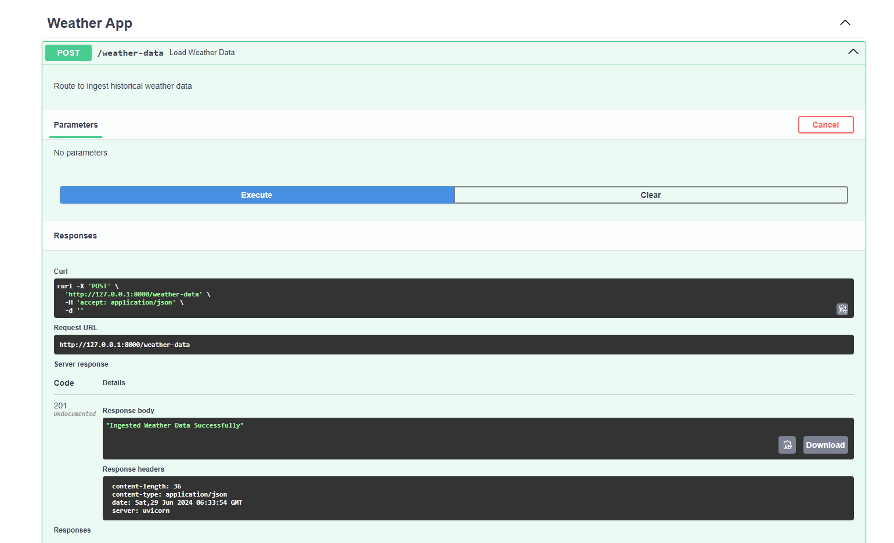

# WEATHER DATA AGGREGATOR AND ANALYZER

## Description
This is an python application created with the help of FastAPI which fetches weather data from Open-Meteo API

## Steps To Set up The Code Base

  1. Cloning the Repository. Open a Terminal and paste the following
        
    git clone https://github.com/DeepDGojariya/Weather-Data-Aggregator-and-Analyzer.git .

  2. After Cloning the Repository open the folder in any Code editor of your choice I'd prefer VSCode. Install dependencies

    pip install -r src/requirements.txt

  3. Let's Boot the Project up.
    
    uvicorn src.main:app --reload

## App Started

## Ingest Data
In Any Browser open http://127.0.0.1:8000/docs this will open up the Swagger UI through which we can test our API's.

    
Open POST /weather-data and click on try it out and then click on execute to load data into the database.

## Analyze Data
Open GET /analytics and enter input parameters

Click on execute to fetch analysis on required parameters

## Visualize Data
Open GET /visualization and enter input parameters for the plot

Click on execute to get the plots for the entered parameters

In the Response Body there will be an option to download file click on that to download a zip file containing images of the plots.
Extract the Zip File to view the plots.

# Some Assumptions to restrict the scope of the project.

1. Historical Weather Data of only a single city(Mumbai) for one month(June 2024) is fetched and ingested.
2. Weather Parameters are fixed to temperature, humidity and wind speed.
3. Weather data is fetched on an hourly basis and stored.
